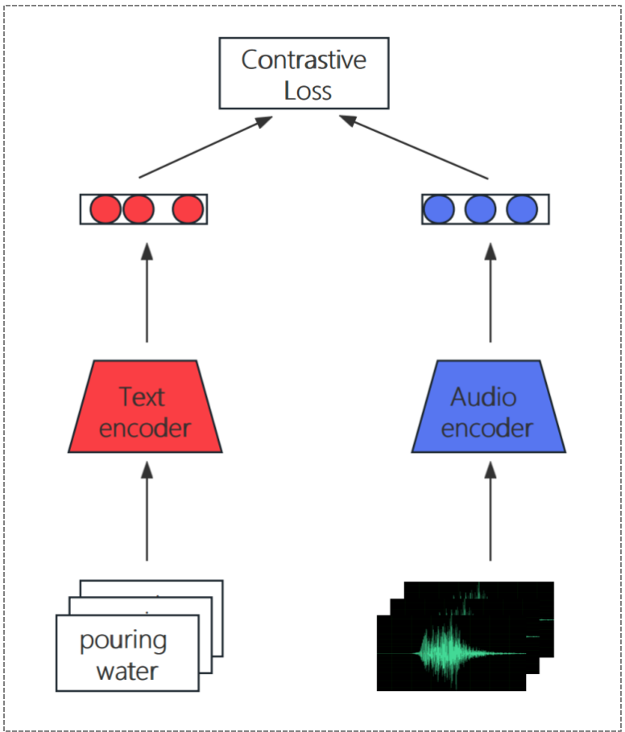

# STA303-Project

## A2CLIP
In the realm of multimodal learning, the integration of diverse sensory inputs like audio and text presents significant challenges and opportunities. This paper introduces a novel approach that leverages the text encoding capabilities of CLIP (Contrastive Language-Image Pretraining) to embed audio features into textual space, thereby establishing a robust linkage between audio and text. These features are then aligned with textual representations obtained via CLIP's powerful encoding mechanism. The proposed system as well as several other ones are tested on a audio-text datasets. The results show that our proposed methods has achieved certain success.

    

